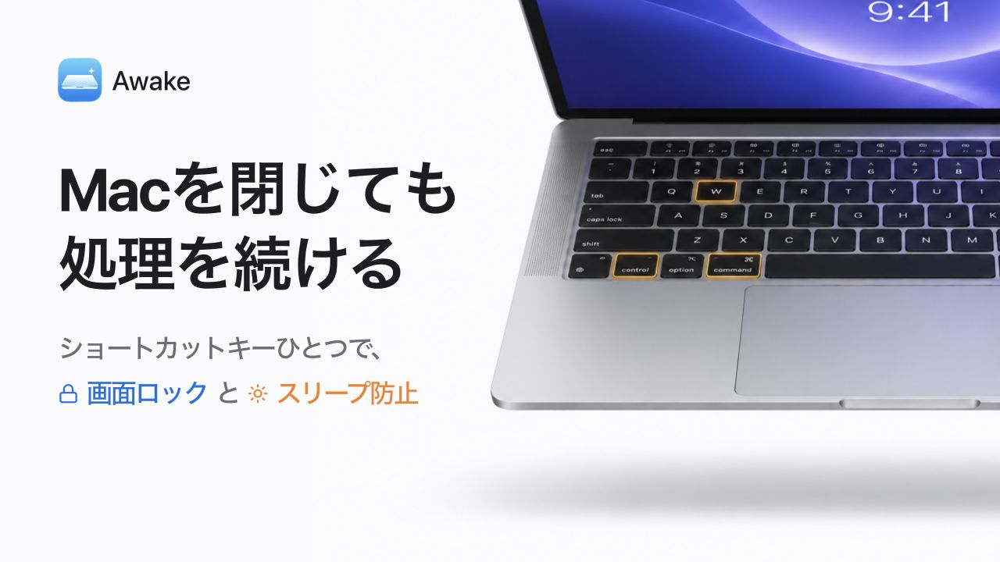

# Awake

Awakeは、MacBookを閉じてもAIエージェントなどの処理を続けられるアプリです。

ショートカットひとつで、画面ロックとスリープ防止を開始。時間とバッテリー残量に応じて自動停止し、動かしっぱなしを防ぎます。

## 対応環境

macOS 26以降、Apple Silicon搭載のMacBook AirおよびMacBook Proに対応しています。

## インストール

1. [Releases](https://github.com/sanamiy/awake/releases)から `.pkg` ファイルをダウンロードして開き、案内に沿ってインストールします。
2. 自動で起動したAwakeで「アクセシビリティ設定を開く」を押し、システム設定でAwakeをオンにします（初回のみ・画面ロックに必要です）。

## 使い方

1. AIエージェントなど、継続したい処理を開始します。
2. **⌃⌘W（Control + Command + W）** を押すと、Awake Modeが始まり、画面ロックとスリープ防止が有効になります。
3. 蓋を閉じて、処理を続けます。
4. 戻ってきたら蓋を開き、ロックを解除するとAwake Modeが自動で終了します。

## 蓋を閉じた後の動作

Awake Mode中に蓋を閉じたときの動作です。

- **処理**：AIエージェントなどの処理はそのまま続きます。
- **画面**：外部ディスプレイも含めて消灯します。
- **音**：通常どおり鳴ります。
- **ネットワーク**：通常どおりWi-Fiやテザリングを利用できます。ただし、利用環境によって接続が切れることがあります。
- **停止**：ロックを解除すると、Awake Modeが終了します。蓋を開くだけでは終了しません。設定時間が経過したときや、バッテリー駆動中に残量が下限に達したときも終了します。電源接続中は、バッテリー残量が下限以下でも継続します。

## 設定できること

| 設定 | 内容 | 初期値 |
| --- | --- | --- |
| スリープ防止の時間 | 動作を続ける時間の上限 | 120分 |
| バッテリー下限 | バッテリー駆動中に停止する残量 | 30% |
| 開始ショートカット | スリープ防止を開始するキー | ⌃⌘W |

## 設定画面を閉じた後

ウインドウを閉じても、ショートカットは使えます。

設定を変更するときは、Spotlightや「アプリケーション」フォルダからAwakeを開いてください。アプリを完全に終了するには、Awakeの設定画面で **⌘Q** を押します。

Awakeはログイン時に自動起動しますが、スリープ防止はショートカットを押すまで開始しません。

## 更新・アンインストール

更新する場合は、Awakeを⌘Qで終了してから、新しいPKGをインストールしてください。別のMacユーザーで使う場合も、そのユーザーでログインしてPKGを実行します。

削除する場合は、設定画面右下の「アンインストール」を使ってください。設定の削除後、「Finderで表示して終了」を押し、FinderでAwakeをゴミ箱へ移してください。時間やショートカットの設定値は、再インストールに備えて残ります。

## 困ったとき

- **ショートカットを押しても始まらない**：Awakeを開き、表示されている案内を確認してください。アクセシビリティを許可した後は、もう一度ショートカットを押します。
- **インストールの修復を案内された**：Awakeを終了し、PKGを再インストールしてください。
- **ほかのスリープ防止アプリを使っている**：そのアプリでスリープ防止を解除してから、Awakeを開始してください。
- **Wi-Fiやテザリングが切れた**：接続元のルーターやスマートフォンも確認してください。Awakeは通信接続の維持を保証しません。

### 解除できない場合

Awakeに表示される「停止を再試行」を押してください。必要に応じて管理者認証が求められます。

アプリが開かない、停止や終了ができない場合は、[トラブルシューティング](docs/TROUBLESHOOTING.md)の復旧手順を確認してください。

---

[開発・仕様ドキュメント](docs/README.md) · [ライセンス（MIT）](LICENSE)
