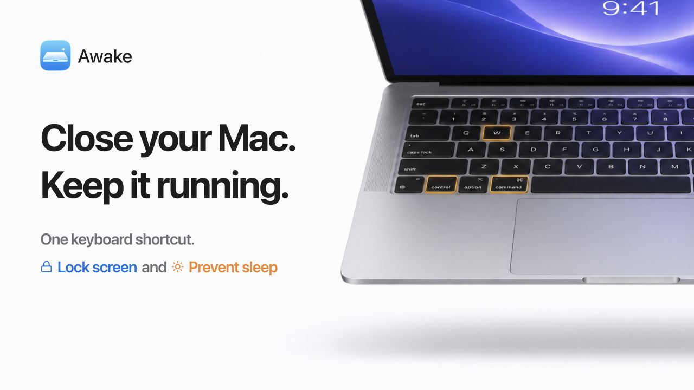

# Awake

English · [日本語](README.ja.md)

Awake keeps AI agents and other tasks running on your MacBook with the lid closed.

One shortcut locks your screen and prevents sleep. A time limit and battery cutoff stop Awake Mode automatically, so your Mac doesn't stay awake indefinitely.

## Requirements

macOS 26 or later on a MacBook Air or MacBook Pro with Apple silicon.

The app supports English and Japanese and follows your macOS language preferences.

## Installation

1. Download the `.pkg` file from [Releases](https://github.com/sanamiy/awake/releases), open it, and follow the installer.
2. When Awake opens, click “Open Accessibility Settings.” In System Settings → Privacy & Security → Accessibility, turn on Awake. This one-time permission is required to lock the screen.

The installer's instructions are currently in Japanese.

## How to use

1. Start the AI agent or other task you want to keep running.
2. Press **⌃⌘W (Control + Command + W)** to start Awake Mode. Your screen locks and sleep prevention begins.
3. Close the lid. Your tasks keep running.
4. When you return, open the lid and unlock your screen. Awake Mode ends automatically.

If the battery is above your limit or your Mac is plugged in, sleep prevention starts with a confirmation sound. On battery at or below the limit, the screen locks without a sound, and your Mac sleeps as usual when you close the lid or normal sleep conditions are met.

## What happens when you close the lid

While Awake Mode is active:

- **Tasks:** AI agents and other tasks keep running.
- **Displays:** All displays turn off, including external displays.
- **Audio:** Sound plays as usual.
- **Network:** Wi-Fi and personal hotspots work as usual, though connections may drop depending on your setup.
- **Stopping:** Unlocking your screen ends Awake Mode. Opening the lid alone does not. Awake Mode also ends when the time limit is reached or, while running on battery, the charge reaches your battery limit. When plugged in, it continues even below the battery limit.

## Settings

| Setting | Description | Default |
| --- | --- | --- |
| Start shortcut | Keyboard shortcut to start Awake Mode | ⌃⌘W |
| Keep-awake duration | Use the slider to select 15 min, 30 min, 1 hr, 2 hr, 4 hr, 8 hr, 24 hr, or Unlimited | 120 min |
| Battery limit | Charge level at which to stop when running on battery; select 5–95% in 5% steps with the slider | 30% |

With Unlimited selected, Awake Mode still ends when you unlock the screen, reach the battery limit while on battery power, or quit the app.

## After closing the settings window

The shortcut keeps working after you close the window.

To change settings, open Awake from Spotlight or the Applications folder. To quit the app completely, press **⌘Q** with Awake's settings window active.

Awake launches at login, but sleep prevention does not start until you press the shortcut.

## Updating and uninstalling

To update, quit Awake with ⌘Q, then install the new PKG. To use Awake with another macOS user account, sign in to that account and run the PKG installer there too.

To uninstall, open Awake's settings window and choose “Uninstall…” from the Awake menu in the menu bar. After the settings are removed, click “Show in Finder and Quit,” then move Awake to the Trash in Finder. Your duration, battery limit, and shortcut preferences are kept for a future reinstall.

## Troubleshooting

- **The shortcut does nothing:** Open Awake and follow the instructions shown. After granting Accessibility permission, press the shortcut again.
- **Awake asks you to repair the installation:** Quit Awake and reinstall the PKG.
- **You use another sleep-prevention app:** Stop sleep prevention in that app before starting Awake.
- **Wi-Fi or your hotspot disconnects:** Check your router or phone too. Awake cannot guarantee that a network connection will stay active.

### If sleep prevention won't stop

Click “Retry Stop” in Awake. You may be asked to authorize the operation as an administrator.

If the app will not open, stop, or quit, see the recovery steps in the [troubleshooting guide (Japanese)](docs/TROUBLESHOOTING.md).

---

[Development and specifications (Japanese)](docs/README.md) · [MIT License](LICENSE)
